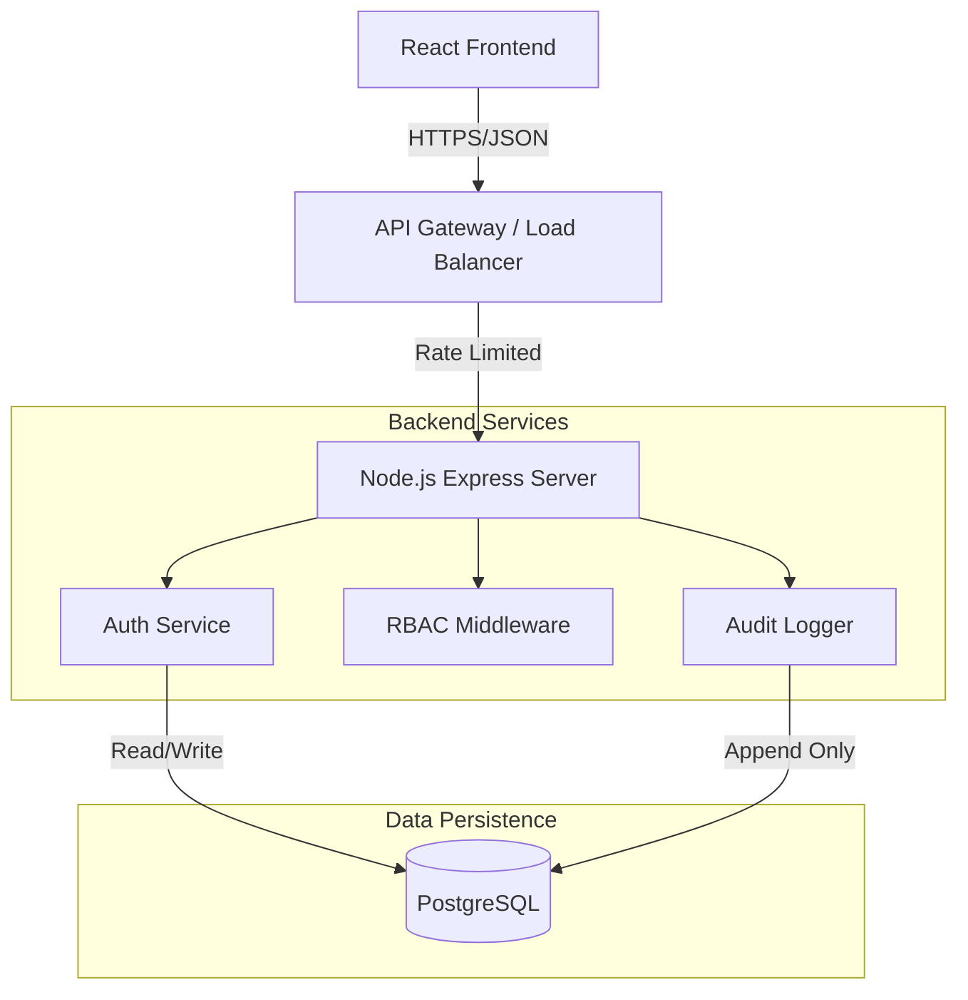

# 🔐 IAM System - Identity & Access Management


## 📖 Introduction

The **IAM System** is a robust, enterprise-grade web application designed to demonstrate advanced **Identity and Access Management** principles. It provides a secure foundation for managing user identities, enforcing **Role-Based Access Control (RBAC)**, and ensuring compliance through immutable **audit logging**.

Built with a security-first mindset, this system mitigates common vulnerabilities (OWASP Top 10) by implementing **Multi-Factor Authentication (MFA)**, secure session management, and cryptographic integrity checks for audit trails. It serves as a comprehensive reference implementation for modern authentication workflows and secure software architecture.

## 🛠️ Tech Stack

The application is built using a modern, scalable technology stack:

| Layer | Technology | Key Features |
|-------|------------|--------------|
| **Frontend** | React 18, Vite | Component-based UI, fast HMR, responsive design |
| **Backend** | Node.js, Express.js | Event-driven architecture, RESTful API |
| **Database** | PostgreSQL 15 | Relational data, ACID transactions, complex queries |
| **Security** | bcryptjs, speakeasy | Adaptive hashing, TOTP generation (RFC 6238) |
| **Auth** | JWT, AES-256-GCM | Stateless sessions, secret encryption at rest |
| **Validation** | Joi | Strict request payload validation |

## ✨ Key Features

### 🛡️ Core Security
*   **Multi-Factor Authentication (MFA)**: Time-based One-Time Password (TOTP) integration compatible with Google/Microsoft Authenticator.
*   **Secure Authentication**: bcryptjs password hashing (cost factor 12), account lockout policies, and session management via HTTP-only cookies.
*   **Rate Limiting**: granular protection against brute-force attacks on login, MFA, and API endpoints.

### 👥 Identity & Access Control
*   **RBAC (Role-Based Access Control)**: Granular permission system with distinct `Admin`, `User`, and `Auditor` roles.
*   **User Management**: Full lifecycle management (CRUD) for user accounts, role assignments, and status toggling.
*   **Profile Management**: Self-service secure password changes and MFA enrollment.

### 📊 Compliance & Observability
*   **Tamper-Evident Audit Logs**: Append-only logging with **cryptographic hash chaining** to detect integrity violations.
*   **Real-Time Monitoring**: Admin-only dashboard featuring live activity feeds and system statistics.
*   **Data Export**: Admin-only log filtering and export capabilities (JSON/CSV) for external auditing.

## 🏗️ Architecture

The system follows a tiered architecture separating concerns between the presentation, business logic, and data layers.



## 🚀 Getting Started

Follow these instructions to set up the project locally for development and testing.

### Prerequisites
*   Node.js v18+
*   PostgreSQL v14+
*   npm or yarn

### Installation

1.  **Clone the Repository**
    ```bash
    git clone https://github.com/joserohit264/zero-trust-IAM
    cd zero-trust-IAM
    ```

2.  **Install Dependencies**
    ```bash
    # Install backend dependencies
    npm install

    # Install frontend dependencies
    cd frontend && npm install && cd ..
    ```

3.  **Environment Configuration**
    Create a `.env` file in the root directory:
    ```bash
    cp .env.example .env
    ```
    *Update `DATABASE_URL` in `.env` to match your local PostgreSQL credentials.*

4.  **Database Setup**
    Create the database and run migrations:
    ```bash
    # Create the database using psql (or pgAdmin)
    psql -U postgres -c "CREATE DATABASE iam_db;"

    # Run schema migrations
    npm run db:migrate

    # Seed default users
    npm run db:seed
    ```

5.  **Run the Application**
    Start both the backend API and frontend dev server:
    ```bash
    # Terminal 1: Backend (http://localhost:5000)
    npm run dev

    # Terminal 2: Frontend (http://localhost:3000)
    cd frontend && npm run dev
    ```

---

### 📚 Documentation

*   [**Security Considerations**](./docs/SECURITY.md): Details on encryption, session handling, and threat models.
*   [**Database Schema**](./docs/DATABASE.md): Entity Relationship Diagrams (ERD) and table definitions.

### 📄 License

This project is licensed under the MIT License - see the [LICENSE](LICENSE) file for details.

